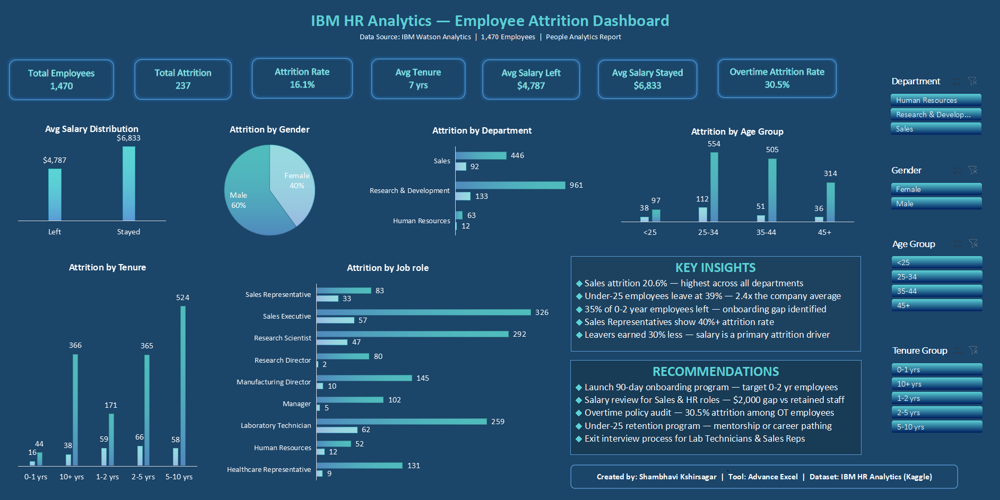

# IBM HR Analytics — Employee Attrition Dashboard

## About This Project
I built this dashboard to go beyond surface-level HR reporting and 
find the real drivers of employee attrition. The finding that 
surprised me most was that overtime — not salary, not age — is the 
strongest predictor of attrition. Employees working overtime leave 
at 30.5%, nearly double the company average of 16.1%. This suggests 
that burnout and work-life balance are bigger retention risks than 
compensation alone — a insight that has direct implications for how 
HR teams should prioritize their interventions.

## Overview
Interactive HR dashboard analyzing attrition patterns across 1,470 employees 
using IBM Watson HR Analytics dataset.

## Key Findings
- Overall attrition rate: 16.1%
- Sales department highest risk: 20.6% attrition rate
- Employees under 25 leave at 39% — highest of any age group
- First 2 years critical: 35%+ attrition in 0-2 yr tenure group
- Employees who left earned 30% less ($4,787 vs $6,833)
- Overtime workers leave at 30.5% — highest single risk factor

## Attrition Rate by Category

| Department | Attrition Rate |
|---|---|
| Human Resources | 19.0% |
| Research & Development | 13.8% |
| Sales | 20.6% |

| Age Group | Attrition Rate |
|---|---|
| <25 | 36% |
| 25-34 | 20% |
| 35-44 | 10% |
| 45+ | 11% |

| Tenure Group | Attrition Rate |
|---|---|
| 0-1 yrs | 36% |
| 1-2 yrs | 35% |
| 2-5 yrs | 18% |
| 5-10 yrs | 11% |
| 10+ yrs | 10% |

| Job Role | Attrition Rate |
|---|---|
| Sales Representative | 40% |
| Laboratory Technician | 24% |
| Human Resources | 23% |
| Research Scientist | 16% |
| Sales Executive | 17% |
| Healthcare Representative | 7% |
| Manufacturing Director | 7% |
| Manager | 5% |
| Research Director | 3% |

## Recommendations
1. 90-day onboarding program for new joiners
2. Salary review for Sales & HR departments
3. Overtime policy audit
4. Under-25 mentorship program
5. Structured exit interviews for high-risk roles

## Tools Used
- Excel
- Formulas: COUNTIF, COUNTIFS, AVERAGEIF
- Pivot Tables & Pivot Charts
- Slicers for interactivity
- Conditional Formatting

## Dataset
IBM HR Analytics Employee Attrition & Performance  
Source: Kaggle — 1,470 rows, 35 columns, 0 null values

## Dashboard Preview

