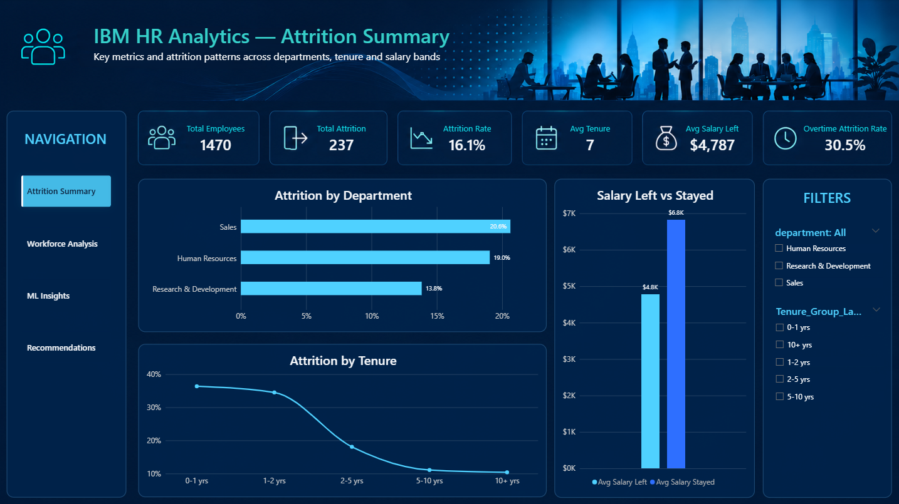
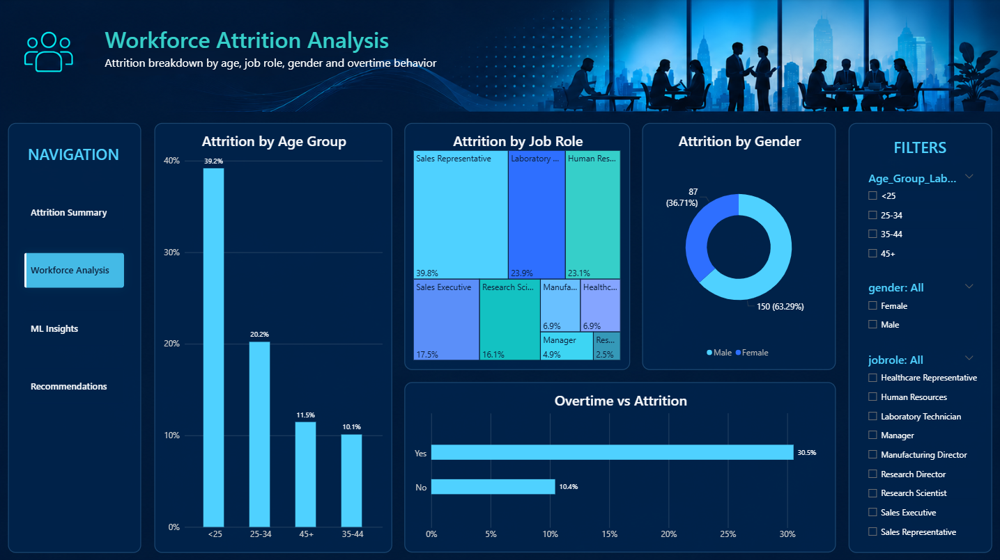
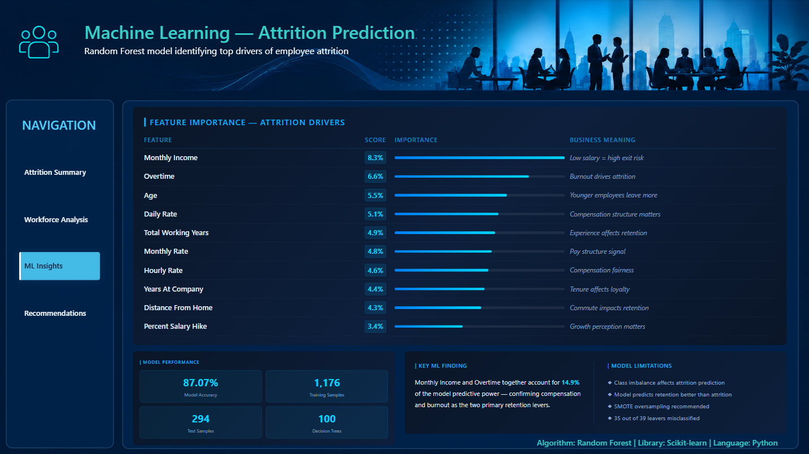
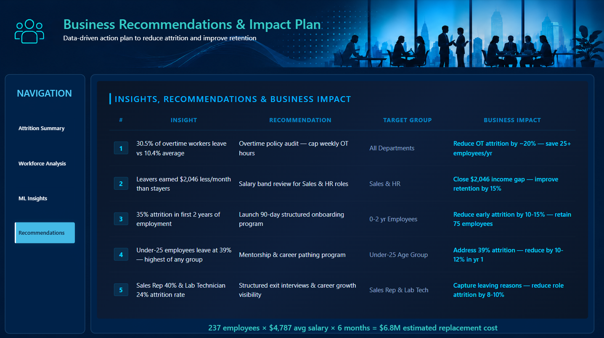

# IBM HR Analytics — End-to-End Attrition Dashboard

## Project Journey
This project started as an Excel dashboard and evolved into a 
complete end-to-end data analytics pipeline. Each tool added 
a new layer of depth to the analysis:

- **Excel** → Built the first dashboard with KPIs, pivot charts and slicers
- **SQL** → Loaded data into PostgreSQL and validated insights with queries
- **Python** → Performed EDA, built visualizations and trained an ML model
- **Power BI** → Rebuilt as a professional 4-page interactive dashboard

## Dashboard
Power BI dashboard screenshots available in the PowerBI folder.

## Key Findings
- Overall attrition rate: **16.1%** (237 out of 1,470 employees)
- Sales department highest risk: **20.6%** attrition rate
- Overtime workers leave at **30.5%** — nearly 2x the average
- Employees who left earned **$2,046 less** per month than stayers
- First 2 years critical: **35%+** attrition in 0-2 yr tenure group
- Under-25 employees leave at **39%** — highest of any age group
- Estimated replacement cost: **$6.8M** for 237 departures

## Machine Learning
- Algorithm: Random Forest Classifier
- Library: Scikit-learn | Language: Python
- Accuracy: **87.07%**
- Training: 1,176 samples | Test: 294 samples
- Top predictor: Monthly Income (8.3% importance)
- Note: Class imbalance affects attrition prediction accuracy

## Attrition Rate Summary

| Department | Attrition Rate |
|---|---|
| Sales | 20.6% |
| Human Resources | 19.0% |
| Research & Development | 13.8% |

| Age Group | Attrition Rate |
|---|---|
| <25 | 36% |
| 25-34 | 20% |
| 35-44 | 10% |
| 45+ | 11% |

| Tenure Group | Attrition Rate |
|---|---|
| 0-1 yrs | 36% |
| 1-2 yrs | 35% |
| 2-5 yrs | 18% |
| 5-10 yrs | 11% |
| 10+ yrs | 10% |

| Job Role | Attrition Rate |
|---|---|
| Sales Representative | 40% |
| Laboratory Technician | 24% |
| Human Resources | 23% |
| Research Scientist | 16% |
| Sales Executive | 17% |

## Recommendations

| # | Insight | Recommendation | Target | Impact |
|---|---|---|---|---|
| 1 | 30.5% OT attrition | Overtime policy audit | All Depts | Save 25+ employees/yr |
| 2 | $2,046 salary gap | Salary band review | Sales & HR | Improve retention 15% |
| 3 | 35% early attrition | 90-day onboarding | 0-2 yr staff | Retain 75 employees |
| 4 | 39% under-25 attrition | Mentorship program | <25 age group | Reduce by 10-12% |
| 5 | 40% Sales Rep attrition | Exit interviews | Sales & Lab Tech | Reduce by 8-10% |

## Tools Used
- **Database:** PostgreSQL
- **Analysis:** Python (Pandas, Seaborn, Matplotlib, Scikit-learn)
- **Dashboard:** Microsoft Power BI (DAX, HTML Visuals, Page Navigation)
- **Excel:** Microsoft Excel (Pivot Tables, COUNTIFS, AVERAGEIF)

## Dataset
IBM HR Analytics Employee Attrition & Performance
Source: Kaggle — 1,470 rows, 35 columns, 0 null values

## Dashboard Preview

### Page 1 — Attrition Summary


### Page 2 — Workforce Analysis


### Page 3 — ML Insights


### Page 4 — Recommendations


## Repository Structure

```text
IBM-HR-Attrition-Dashboard/
│
├── Excel/
├── SQL/
├── Python/
├── PowerBI/
├── Dataset/
└── README.md
```

## Dataset

IBM HR Analytics Employee Attrition & Performance

- Source: Kaggle
- Rows: 1,470
- Columns: 35
- Missing Values: 0

## Project By
**Shambhavi Kshirsagar**
Data Analytics Portfolio Project | May 2026
